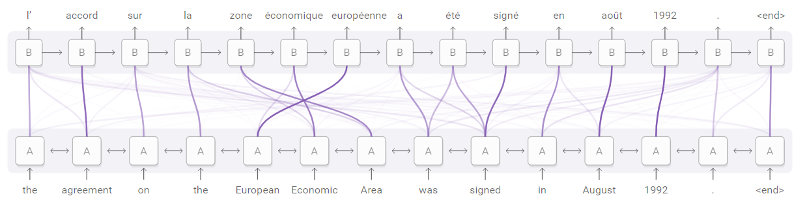

# nlpRoadmap

## Reference
[GitHub - DeepNLP-models-Pytorch](https://github.com/huankiki/DeepNLP-models-Pytorch)  
[GitHub - nlp-tutorial](https://github.com/huankiki/nlp-tutorial)  
[GitHub - nlp-roadmap](https://github.com/HaveTwoBrush/nlp-roadmap)  

## √ Theory, 理论篇： Deep Learning
- [x] RNN
- [x] LSTM/GRU
- [x] TextCNN

## Theory, 理论篇： Language Model & Word Embedding
### Word Embedding
- [x] NNLM
- [x] word2vec
  - [x] Skip-gram
  - [x] C-BOW
- [x] GloVe  
[GloVe词向量理解](https://www.jianshu.com/p/5bbb55c35961)  
[GloVe与word2vec的联系](https://ranmaosong.github.io/2018/11/21/nlp-glove/)  
***GloVe可以被看成是更换了目标函数和权重函数的全局word2vec***  
- [x] fastText  
[fastText论文解读、fastText与word2vec的区别和联系](https://blog.csdn.net/u011239443/article/details/80076720)  
  - fastText可以用来学习词向量，也可以进行有监督的学习，如文本分类
  - 相似点：fastText的结构与word2vec的CBOW的结构相似，并且采用了相同的优化方法，如Hierarchical Softmax
  - 不同点：有监督fastText其实是将CBOW模型的中心词改成label（即输出层变化），将上下文词改成整个句子中的词，包括N-gram（即输入层变化）
  
### Pretrained NLP Models
- [x] Seq2Seq  
真正提出Seq2Seq的是文献[1]，但文献[2]更早地使用了Seq2Seq模型来解决机器翻译的问题。文献[1]引用了文献[2]。
  - [1] Sequence to Sequence Learning, 2014, Google  
 此文的工程性更强，计算量很大：8-GPU machine, Training took about a ten days with this implementation
  - [2] Learning Phrase Representations using RNN Encoder–Decoder for Statistical Machine Translation, 2014  
  文献[2]末尾详细给出了**RNN Encoder-Decoder**的公式推导，此文的**最大贡献是提出了GRU结构**，LSTM的简化版。
- [x] Attention  
此文作者与Seq2Seq的作者相同，包括Yoshua Bengio大神，学术味很浓，公式推导很详尽。  
此文是第一个将attention机制应用到NLP领域的工作，把attention机制用到了神经网络机器翻译的RNN Encoder-Decoder模型中。  
[Attention论文的中文翻译](https://blog.csdn.net/qq_20135597/article/details/83758013)  
延伸阅读：[注意力机制（Attention Mechanism）在自然语言处理中的应用](https://www.cnblogs.com/robert-dlut/p/5952032.html)  
  
- [x] **Transformer**  
从英语阅读来讲，此文易读，但是看不懂:(  
拜读了对Transformer的解读之后，感慨：Transformer真的是简约不简单！ 推荐：  
[The Illustrated Transformer-Jay Alammar](https://jalammar.github.io/illustrated-transformer/)  
[The Illustrated Transformer【译】](https://blog.csdn.net/yujianmin1990/article/details/85221271)  
  
- [x] ELMO  
Embeddings from Language Models。ELMo是双向语言模型biLM的多层表示的组合，基于大量文本，从深层的双向语言模型（deep bidirectional language model）中的内部状态(internal state)学习而来。不仅能够学习到词语用法在语义和语法上的复杂特点，而且能够学习不同上下文情况下的词汇多义性。论文标题：Deep contextualized word representations，即深度语境化的单词表示，可以根据上下文学习。  
[ELMo算法介绍](https://blog.csdn.net/triplemeng/article/details/82380202)
- [x] OpenAI GPT  
此文提出一种半监督的方式来提升语言理解的任务。
  - 使用非监督的预训练和监督方式的微调（**unsupervised pre-training and supervised fine-tuning**）。目标是学习一个通用的语言表示，然后经过很小的调整就可以应用在各种任务中。这个模型的设置不需要目标任务和非标注的数据集在同一个领域。
  - 模型有两个过程：1，在未标记的数据上训练语言模型，即unsupervised pre-training；2，然后使用相应的监督目标使这些参数适应目标任务
  - **思想上与ELMo相似**，即迁移学习在nlp领域的应用。不同点是ELMo的语言模型是基于LSTM的BiLM，而GPT的语言模型是基于多层Transformer的decoder的语言模型，相比LSTM，可以更好的捕获长距离语言结构。另外，在有监督学习微调时，需要将不同任务的输入变换成预训练模型需要的形式。
  - 在12个NLP任务上进行了实验，9个任务获得了最好的结果  
  
[OpenAI GPT-译](https://zhuanlan.zhihu.com/p/54754171)

- [ ] Google BERT  
与Transformer的那篇解读是同一个Blog。  
[The Illustrated BERT, ELMo, and co. (How NLP Cracked Transfer Learning)-Jay Alammar](https://jalammar.github.io/illustrated-bert/)  
[The Illustrated BERT【译】](https://blog.csdn.net/qq_41664845/article/details/84787969)  

#### 相关阅读
- [从Attention,Transformer,ELMO,GPT到BERT](http://www.bdpt.net/cn/2019/01/22/%E6%B7%B1%E5%BA%A6%E5%AD%A6%E4%B9%A0%EF%BC%9A%E5%89%8D%E6%B2%BF%E6%8A%80%E6%9C%AF-%E4%BB%8Eattentiontransformerelmogpt%E5%88%B0bert/)  
- [从Word Embedding到Bert模型—自然语言处理中的预训练技术发展史](https://zhuanlan.zhihu.com/p/49271699)  
- [自然语言处理中的语言模型预训练方法（ELMo、GPT和BERT）](https://www.cnblogs.com/robert-dlut/p/9824346.html)  
- [一文读懂深度学习：从神经元到BERT—阿里技术](https://mp.weixin.qq.com/s/wrqxuMidw7HvgTVUvTBGng)  

## Practice，实践篇
[FudanNLP/nlp-beginner](https://github.com/FudanNLP/nlp-beginner)

### Sequence Labelling, POS Tagging/NER
序列标注：词性标注/命名实体识别
- [ ] HMM
- [ ] CRF
- [ ] MEM，最大熵
- [ ] (Bi)LSTM + CRF

### Text Classification & Sentiment Analysis
文本分类、情感分析
- [ ] LR/Softmax + BOW/tf-idf + n-gram
- [ ] SVM + BOW/tf-idf + n-gram
- [ ] TextCNN
- [ ] LSTM + Word Embedding

### Language Model (NN)
基于神经网络的语言模型的训练
- [ ] word2vec/gensim
- [ ] RNN/LSTM/GRU

### Dialog System
对话系统

### Topic Model
主题模型
- [ ] LDA

